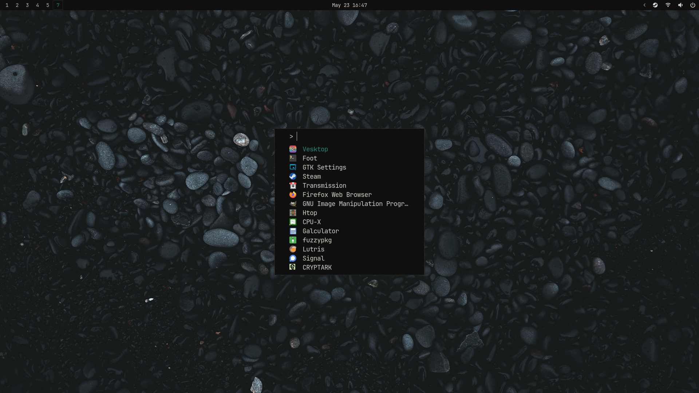
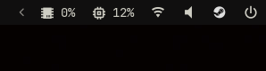

# Dotfiles

List of configs to my keyboard-driven system. My point was to get light weight system without useless annoyances.

### Software I use

- Distro: [Void](https://voidlinux.org/)
- Bar: [Waybar](https://github.com/Alexays/Waybar)
- WM: **Sway**
- Cron daemon: [snooze](https://github.com/leahneukirchen/snooze)
- Editor: [neovim](https://neovim.io/)
- Filemanager: [lf](https://github.com/gokcehan/lf/)
- Fonts: JetBrains Mono
- GTK-theme: [adw-gtk3](https://github.com/lassekongo83/adw-gtk3)
- Image Viewer: [swayimg](https://github.com/artemsen/swayimg)
- Launcher: [fuzzel](https://codeberg.org/dnkl/fuzzel)
- Login Manager: [tuigreet](https://github.com/apognu/tuigreet)
- Media Player: [mpv](https://mpv.io/)
- Notification daemon: [fnott](https://codeberg.org/dnkl/fnott)
- Screenlocker: [swaylock](https://github.com/swaywm/swaylock)
- Session and Seat management: [seatd](https://docs.voidlinux.org/config/session-management.html#seatd) and [turnstile](https://docs.voidlinux.org/config/session-management.html#turnstile)
- Symbols and icons: [Nerd Font Symbols](https://www.nerdfonts.com/)
- Terminal: [foot](https://codeberg.org/dnkl/foot)

---

## Note

> If you have just installed Void and copied everything from here, you won't get working system just yet.
>
> Check out but **Don't run** _/.local/bin/void/void_kickstart.sh_ to get the idea what services are needed
>
> Good luck!

#### Sources where I stole most of my cool stuff ⭐

- [SwayKh](https://github.com/SwayKh/dotfiles/tree/main) - Showed me how to configure River 😍
- [Official install guide](https://docs.voidlinux.org/installation/index.html) - Helped me to setup Void 👍
- [kennydodrill.com/blog](https://kennydodrill.com/blog/stable-void-linux-setup-guide/) - Helped me to setup Void 👍
- [Mind's Forge](https://mindsforge.com/Notes/VoidInstall) - Helped me setup Wayland ⭐
- [newmanls](https://github.com/newmanls/dotfiles) - Helped me with TONS of stuff ⭐
- [classabbyamp](https://github.com/classabbyamp) - Helped me with TONS of stuff ⭐
- [aellas](https://github.com/aellas) - For TONS of ideas and ispiration ⭐ ❤️ 🐐
- [Joris](https://codeberg.org/jorisvandijk) - For showing me how to manage my dots better ❤️ ⭐

#### Special thanks ⭐

- [fesowowako](https://github.com/fesowowako) and his commits from [My Sway-dotfiles](https://github.com/bitterhalt/dots-sway)
