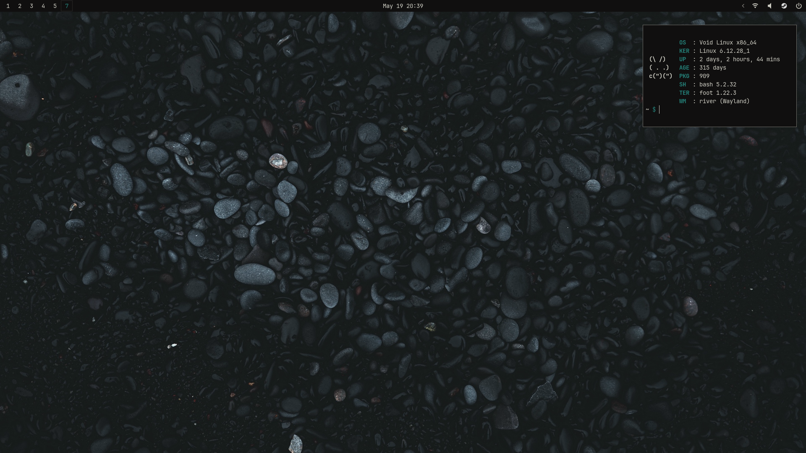

## My dots

List of configs to my keyboard-driven system. My point was to get light weight system without useless annoyances.

**! ! ! ⚠️ IMPORTANT ⚠️ ! ! !**

> If you have just installed Void and copied everything from here, you won't get working system just yet.
>
> Check out but **Don't run** _/.local/bin/void/void_kickstart.sh_ to get the idea what services are needed
>
> Good luck!

### Software I use

- Distro: [Void](https://voidlinux.org/)
- Bar: [Yambar](https://codeberg.org/dnkl/yambar)
- WM: [River](https://codeberg.org/river/river)
- Cron daemon: [snooze](https://github.com/leahneukirchen/snooze)
- Editor: [neovim](https://neovim.io/)
- Filemanager: [lf](https://github.com/gokcehan/lf/)
- Fonts: JetBrains Mono
- GTK-theme: [adw-gtk3](https://github.com/lassekongo83/adw-gtk3)
- Image Viewer: [imv](https://sr.ht/~exec64/imv)
- Launcher: [bemenu](https://github.com/Cloudef/bemenu)
- Login Manager: [Greetd](https://git.sr.ht/~kennylevinsen/greetd)
- Media Player: [mpv](https://mpv.io/)
- Notification daemon: [fnott](https://codeberg.org/dnkl/fnott)
- Screenlocker: [waylock](https://git.sr.ht/~ifreund/waylock)
- Session and Seat management: [seatd](https://docs.voidlinux.org/config/session-management.html#seatd) and [turnstile](https://docs.voidlinux.org/config/session-management.html#turnstile)
- Symbols and icons: [Nerd Font Symbols](https://www.nerdfonts.com/)
- Tag-overlay: [river-tag-overlay](https://git.sr.ht/~leon_plickat/river-tag-overlay)
- Terminal: [foot](https://codeberg.org/dnkl/foot)

---

### Main key bindings

> Here is a list of the main key combinations
>
> The rest can be found in **$HOME/.config/river/init**
>
> If you have used DWM before you are already home

| Key                                   | Description                                          |
| ------------------------------------- | ---------------------------------------------------- |
| Super + Enter                         | Open Terminal                                        |
| Super + D                             | Open Bemenu                                          |
| Super + Control + R                   | Reload config                                        |
| Super + W                             | Open Web Browser                                     |
| Super + E                             | Open Filemanager                                     |
| Super + {1,2,3,4,5,6,7,8,9}           | View another tag                                     |
| Super + Shift + {1,2,3,4,5,6,7,8,9}   | Move focused tags to another tag view                |
| Super + 0                             | View all tags                                        |
| Super + Control + {1,2,3,4,5,6,7,8,9} | Toggle/"combine" different tag views                 |
| Super + Shift + P                     | Open Powermenu                                       |
| Super + {J,K}                         | Focus the next/previous view                         |
| Super + Shift + {J,K}                 | Swap the focused view                                |
| Super + {, .}                         | Focus next/previous output                           |
| Super + Shift {, .}                   | Send focused view to the next/previous output        |
| Super + BackSpace                     | Bump the focused view to the top of the layout stack |
| Super + {L,H}                         | Decrease/increase the main ratio of Rivertile        |
| Super + Shift + {Prior,Next}          | Increment/decrement the main count of Rivertile      |
| Super + F                             | Toggle fullscreen                                    |
| Super + Left + Mouse                  | Float and move the window                            |
| Super + Alt + {H,J,K,L}               | Change layout orientation {left,bottom,top,right}    |

#### Sources where I stole most of my cool stuff ⭐

- [SwayKh](https://github.com/SwayKh/dotfiles/tree/main) - Showed me how to configure River 😍
- [Official install guide](https://docs.voidlinux.org/installation/index.html) - Helped me to setup Void 👍
- [kennydodrill.com/blog](https://kennydodrill.com/blog/stable-void-linux-setup-guide/) - Helped me to setup Void 👍
- [Mind's Forge](https://mindsforge.com/Notes/VoidInstall) - Helped me setup Wayland ⭐
- [newmanls](https://github.com/newmanls/dotfiles) - Helped me with TONS of stuff ⭐
- [classabbyamp](https://github.com/classabbyamp) - Helped me with TONS of stuff ⭐
- [aellas](https://github.com/aellas) - For TONS of ideas and ispiration ⭐ ❤️ 🐐
- [Joris](https://codeberg.org/jorisvandijk) - For showing me how to manage my dots better ❤️ ⭐

#### Special thanks ⭐

- [fesowowako](https://github.com/fesowowako) and his commits from [My Sway-dotfiles](https://github.com/bitterhalt/dots-sway)
